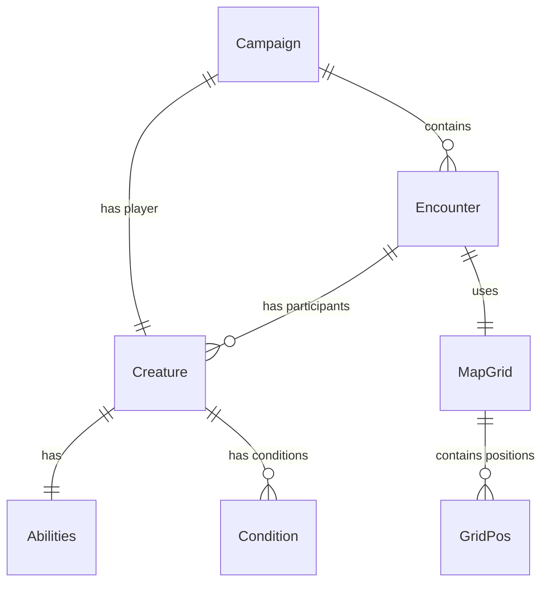
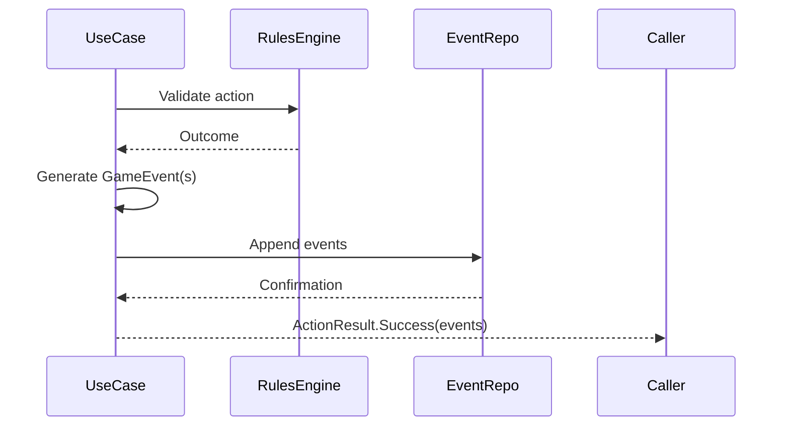

# Design Document: Core Domain Models

## Overview

The Core Domain Models specification establishes the foundational layer of QuestWeaver's Clean Architecture implementation. This pure Kotlin module (`core:domain`) provides immutable business entities, event sourcing infrastructure, repository contracts, and use case interfaces that form the basis for all game logic. The design prioritizes immutability, type safety, testability, and strict separation from Android framework dependencies.

## Architecture

### Module Structure

```
core/domain/src/main/kotlin/dev/questweaver/core/domain/
├── entities/
│   ├── Creature.kt
│   ├── Campaign.kt
│   ├── Encounter.kt
│   └── MapGrid.kt
├── events/
│   ├── GameEvent.kt
│   ├── EncounterEvents.kt
│   ├── CombatEvents.kt
│   └── MovementEvents.kt
├── repositories/
│   ├── EventRepository.kt
│   ├── CreatureRepository.kt
│   ├── CampaignRepository.kt
│   └── EncounterRepository.kt
├── usecases/
│   ├── ActionResult.kt
│   └── (interfaces only - implementations in feature modules)
└── values/
    ├── GridPos.kt
    ├── Abilities.kt
    ├── DiceRoll.kt
    └── TerrainType.kt
```

### Dependency Rules

- **NO Android dependencies** - only Kotlin stdlib and kotlinx-serialization
- **NO implementation code for repositories or use cases** - interfaces only
- **NO mutable state** - all entities and value objects are immutable
- **NO business logic** - pure data structures with validation only

### Build Configuration

```kotlin
// core/domain/build.gradle.kts
plugins {
    kotlin("jvm")
    kotlin("plugin.serialization")
}

dependencies {
    implementation(libs.kotlinx.serialization.json)
    implementation(libs.kotlinx.coroutines.core)
    
    testImplementation(libs.kotest.runner.junit5)
    testImplementation(libs.kotest.assertions.core)
    testImplementation(libs.kotest.property)
}
```

## Components and Interfaces

### 1. Entity Classes

#### Creature Entity

Represents any combatant (PC, NPC, or monster) with D&D 5e attributes.

```kotlin
@Serializable
data class Creature(
    val id: Long,
    val name: String,
    val armorClass: Int,
    val hitPointsCurrent: Int,
    val hitPointsMax: Int,
    val speed: Int,
    val abilities: Abilities,
    val proficiencyBonus: Int = 2,
    val conditions: Set<Condition> = emptySet()
) {
    init {
        require(id > 0) { "Creature id must be positive" }
        require(name.isNotBlank()) { "Creature name cannot be blank" }
        require(armorClass > 0) { "Armor class must be positive" }
        require(hitPointsMax > 0) { "Max HP must be positive" }
        require(hitPointsCurrent in 0..hitPointsMax) { "Current HP must be between 0 and max HP" }
        require(speed >= 0) { "Speed cannot be negative" }
    }
    
    val isAlive: Boolean get() = hitPointsCurrent > 0
    val isBloodied: Boolean get() = hitPointsCurrent <= hitPointsMax / 2
}
```

#### Campaign Entity

Represents a game campaign with metadata and settings.

```kotlin
@Serializable
data class Campaign(
    val id: Long,
    val name: String,
    val createdTimestamp: Long,
    val lastPlayedTimestamp: Long,
    val playerCharacterId: Long,
    val settings: CampaignSettings
) {
    init {
        require(id > 0) { "Campaign id must be positive" }
        require(name.isNotBlank()) { "Campaign name cannot be blank" }
        require(createdTimestamp > 0) { "Created timestamp must be positive" }
        require(lastPlayedTimestamp >= createdTimestamp) { "Last played cannot be before created" }
        require(playerCharacterId > 0) { "Player character id must be positive" }
    }
}

@Serializable
data class CampaignSettings(
    val difficulty: Difficulty = Difficulty.NORMAL,
    val contentRating: ContentRating = ContentRating.TEEN
)

enum class Difficulty { EASY, NORMAL, HARD, DEADLY }
enum class ContentRating { EVERYONE, TEEN, MATURE }
```

#### Encounter Entity

Represents a tactical combat encounter with participants and turn tracking.

```kotlin
@Serializable
data class Encounter(
    val id: Long,
    val campaignId: Long,
    val createdTimestamp: Long,
    val currentRound: Int,
    val activeCreatureId: Long?,
    val participants: List<Long>,
    val initiativeOrder: List<InitiativeEntry>,
    val status: EncounterStatus = EncounterStatus.IN_PROGRESS
) {
    init {
        require(id > 0) { "Encounter id must be positive" }
        require(campaignId > 0) { "Campaign id must be positive" }
        require(currentRound >= 1) { "Current round must be at least 1" }
        require(participants.isNotEmpty()) { "Encounter must have at least one participant" }
        if (activeCreatureId != null) {
            require(activeCreatureId in participants) { "Active creature must be a participant" }
        }
        require(initiativeOrder.map { it.creatureId }.toSet() == participants.toSet()) {
            "Initiative order must include all participants exactly once"
        }
    }
}

@Serializable
data class InitiativeEntry(
    val creatureId: Long,
    val initiative: Int
)

enum class EncounterStatus { IN_PROGRESS, VICTORY, DEFEAT, FLED }
```

#### MapGrid Entity

Represents a tactical grid map with terrain.

```kotlin
@Serializable
data class MapGrid(
    val width: Int,
    val height: Int,
    val terrain: Map<GridPos, TerrainType> = emptyMap(),
    val creaturePositions: Map<Long, GridPos> = emptyMap()
) {
    init {
        require(width > 0) { "Width must be positive" }
        require(height > 0) { "Height must be positive" }
        terrain.keys.forEach { pos ->
            require(pos.x in 0 until width && pos.y in 0 until height) {
                "Terrain position $pos is outside grid bounds"
            }
        }
        creaturePositions.values.forEach { pos ->
            require(pos.x in 0 until width && pos.y in 0 until height) {
                "Creature position $pos is outside grid bounds"
            }
        }
    }
    
    fun isInBounds(pos: GridPos): Boolean =
        pos.x in 0 until width && pos.y in 0 until height
    
    fun getTerrainAt(pos: GridPos): TerrainType =
        terrain[pos] ?: TerrainType.EMPTY
}
```

### 2. Value Objects

#### GridPos

Represents a position on the tactical grid.

```kotlin
@Serializable
data class GridPos(
    val x: Int,
    val y: Int
) {
    init {
        require(x >= 0) { "X coordinate cannot be negative" }
        require(y >= 0) { "Y coordinate cannot be negative" }
    }
    
    fun distanceTo(other: GridPos): Int =
        maxOf(kotlin.math.abs(x - other.x), kotlin.math.abs(y - other.y))
    
    fun neighbors(): List<GridPos> = listOf(
        GridPos(x - 1, y), GridPos(x + 1, y),
        GridPos(x, y - 1), GridPos(x, y + 1),
        GridPos(x - 1, y - 1), GridPos(x + 1, y - 1),
        GridPos(x - 1, y + 1), GridPos(x + 1, y + 1)
    ).filter { it.x >= 0 && it.y >= 0 }
}
```

#### Abilities

Represents D&D 5e ability scores.

```kotlin
@Serializable
data class Abilities(
    val strength: Int = 10,
    val dexterity: Int = 10,
    val constitution: Int = 10,
    val intelligence: Int = 10,
    val wisdom: Int = 10,
    val charisma: Int = 10
) {
    init {
        require(strength in 1..30) { "Strength must be between 1 and 30" }
        require(dexterity in 1..30) { "Dexterity must be between 1 and 30" }
        require(constitution in 1..30) { "Constitution must be between 1 and 30" }
        require(intelligence in 1..30) { "Intelligence must be between 1 and 30" }
        require(wisdom in 1..30) { "Wisdom must be between 1 and 30" }
        require(charisma in 1..30) { "Charisma must be between 1 and 30" }
    }
    
    val strModifier: Int get() = (strength - 10) / 2
    val dexModifier: Int get() = (dexterity - 10) / 2
    val conModifier: Int get() = (constitution - 10) / 2
    val intModifier: Int get() = (intelligence - 10) / 2
    val wisModifier: Int get() = (wisdom - 10) / 2
    val chaModifier: Int get() = (charisma - 10) / 2
}
```

#### DiceRoll

Represents a dice roll with result.

```kotlin
@Serializable
data class DiceRoll(
    val diceType: Int,
    val count: Int,
    val modifier: Int = 0,
    val result: Int
) {
    init {
        require(diceType in listOf(4, 6, 8, 10, 12, 20, 100)) { "Invalid dice type: $diceType" }
        require(count > 0) { "Dice count must be positive" }
        require(result >= count + modifier) { "Result cannot be less than minimum possible roll" }
        require(result <= (count * diceType) + modifier) { "Result cannot exceed maximum possible roll" }
    }
    
    override fun toString(): String = "${count}d${diceType}${if (modifier >= 0) "+" else ""}$modifier = $result"
}
```

#### TerrainType

Enum representing terrain types on the map.

```kotlin
enum class TerrainType {
    EMPTY,
    DIFFICULT,
    IMPASSABLE,
    OCCUPIED
}
```

#### Condition

Enum representing D&D 5e conditions.

```kotlin
enum class Condition {
    BLINDED,
    CHARMED,
    DEAFENED,
    FRIGHTENED,
    GRAPPLED,
    INCAPACITATED,
    INVISIBLE,
    PARALYZED,
    PETRIFIED,
    POISONED,
    PRONE,
    RESTRAINED,
    STUNNED,
    UNCONSCIOUS
}
```

### 3. Event Sourcing Architecture

#### GameEvent Sealed Interface

Base interface for all game events.

```kotlin
@Serializable
sealed interface GameEvent {
    val sessionId: Long
    val timestamp: Long
}
```

#### Encounter Events

```kotlin
@Serializable
data class EncounterStarted(
    override val sessionId: Long,
    override val timestamp: Long,
    val encounterId: Long,
    val participants: List<Long>,
    val initiativeOrder: List<InitiativeEntry>
) : GameEvent

@Serializable
data class RoundStarted(
    override val sessionId: Long,
    override val timestamp: Long,
    val encounterId: Long,
    val roundNumber: Int
) : GameEvent

@Serializable
data class TurnStarted(
    override val sessionId: Long,
    override val timestamp: Long,
    val encounterId: Long,
    val creatureId: Long
) : GameEvent

@Serializable
data class TurnEnded(
    override val sessionId: Long,
    override val timestamp: Long,
    val encounterId: Long,
    val creatureId: Long
) : GameEvent

@Serializable
data class EncounterEnded(
    override val sessionId: Long,
    override val timestamp: Long,
    val encounterId: Long,
    val status: EncounterStatus
) : GameEvent
```

#### Combat Events

```kotlin
@Serializable
data class AttackResolved(
    override val sessionId: Long,
    override val timestamp: Long,
    val attackerId: Long,
    val targetId: Long,
    val attackRoll: DiceRoll,
    val targetAC: Int,
    val hit: Boolean,
    val critical: Boolean = false
) : GameEvent

@Serializable
data class DamageApplied(
    override val sessionId: Long,
    override val timestamp: Long,
    val targetId: Long,
    val damageRoll: DiceRoll,
    val damageAmount: Int,
    val hpBefore: Int,
    val hpAfter: Int
) : GameEvent

@Serializable
data class ConditionApplied(
    override val sessionId: Long,
    override val timestamp: Long,
    val targetId: Long,
    val condition: Condition,
    val duration: Int?
) : GameEvent

@Serializable
data class ConditionRemoved(
    override val sessionId: Long,
    override val timestamp: Long,
    val targetId: Long,
    val condition: Condition
) : GameEvent
```

#### Movement Events

```kotlin
@Serializable
data class MoveCommitted(
    override val sessionId: Long,
    override val timestamp: Long,
    val creatureId: Long,
    val fromPos: GridPos,
    val toPos: GridPos,
    val path: List<GridPos>,
    val movementCost: Int
) : GameEvent
```

### 4. Repository Interfaces

#### EventRepository

```kotlin
interface EventRepository {
    suspend fun append(event: GameEvent)
    suspend fun appendAll(events: List<GameEvent>)
    suspend fun forSession(sessionId: Long): List<GameEvent>
    fun observeSession(sessionId: Long): Flow<List<GameEvent>>
}
```

#### CreatureRepository

```kotlin
interface CreatureRepository {
    suspend fun getById(id: Long): Creature?
    suspend fun getAll(): List<Creature>
    suspend fun insert(creature: Creature): Long
    suspend fun update(creature: Creature)
    suspend fun delete(id: Long)
    fun observe(id: Long): Flow<Creature?>
}
```

#### CampaignRepository

```kotlin
interface CampaignRepository {
    suspend fun getById(id: Long): Campaign?
    suspend fun getAll(): List<Campaign>
    suspend fun insert(campaign: Campaign): Long
    suspend fun update(campaign: Campaign)
    suspend fun delete(id: Long)
    fun observeAll(): Flow<List<Campaign>>
}
```

#### EncounterRepository

```kotlin
interface EncounterRepository {
    suspend fun getById(id: Long): Encounter?
    suspend fun getByCampaign(campaignId: Long): List<Encounter>
    suspend fun insert(encounter: Encounter): Long
    suspend fun update(encounter: Encounter)
    suspend fun delete(id: Long)
    fun observe(id: Long): Flow<Encounter?>
}
```

### 5. Use Case Result Types

#### ActionResult

```kotlin
sealed interface ActionResult {
    data class Success(val events: List<GameEvent>) : ActionResult
    data class Failure(val reason: String) : ActionResult
    data class RequiresChoice(val options: List<ActionOption>) : ActionResult
}

data class ActionOption(
    val id: String,
    val description: String,
    val metadata: Map<String, Any> = emptyMap()
)
```

## Data Models

### Entity Relationships



### Event Flow



## Error Handling

### Validation Strategy

- **Constructor validation**: All entities and value objects validate in init blocks
- **Fail-fast**: Invalid state throws IllegalArgumentException immediately
- **Clear messages**: Error messages describe what constraint was violated
- **No silent failures**: Never return null or default values for invalid input

### Error Types

```kotlin
sealed class DomainError : Exception() {
    data class InvalidEntity(val entityType: String, val reason: String) : DomainError()
    data class InvalidOperation(val operation: String, val reason: String) : DomainError()
    data class NotFound(val entityType: String, val id: Long) : DomainError()
}
```

## Testing Strategy

### Unit Tests

- **Property-based tests** for value objects (kotest property testing)
- **Validation tests** for all entity constructors
- **Computed property tests** for ability modifiers, distance calculations
- **Serialization tests** for all @Serializable classes

### Test Examples

```kotlin
class AbilitiesTest : FunSpec({
    context("ability modifiers") {
        test("strength 10 has modifier 0") {
            Abilities(strength = 10).strModifier shouldBe 0
        }
        
        test("strength 20 has modifier +5") {
            Abilities(strength = 20).strModifier shouldBe 5
        }
        
        test("strength 8 has modifier -1") {
            Abilities(strength = 8).strModifier shouldBe -1
        }
    }
    
    context("validation") {
        test("ability scores must be between 1 and 30") {
            checkAll(Arb.int(1..30)) { score ->
                shouldNotThrowAny {
                    Abilities(strength = score)
                }
            }
        }
        
        test("ability scores below 1 throw exception") {
            shouldThrow<IllegalArgumentException> {
                Abilities(strength = 0)
            }
        }
    }
})
```

### Coverage Target

- **90%+ line coverage** for all domain classes
- **100% coverage** for validation logic
- **Property-based tests** for mathematical operations

## Performance Considerations

- **Immutable data structures**: Enable structural sharing and safe concurrency
- **Lazy computed properties**: Ability modifiers computed on access, not stored
- **Efficient collections**: Use List for ordered data, Set for uniqueness checks
- **No premature optimization**: Focus on correctness first, profile before optimizing

## Security Considerations

- **No sensitive data in domain layer**: PII handled at data layer with encryption
- **Validation prevents injection**: All string inputs validated for length and content
- **No reflection**: Avoid runtime reflection for security and performance
- **Serialization safety**: Use kotlinx-serialization with explicit @Serializable annotations

## Migration Strategy

This is the initial implementation, so no migration is required. Future changes to domain models must:

1. Maintain backward compatibility with existing events
2. Use versioned serialization if breaking changes are necessary
3. Provide migration functions for converting old events to new format
4. Document all breaking changes in CHANGELOG.md
